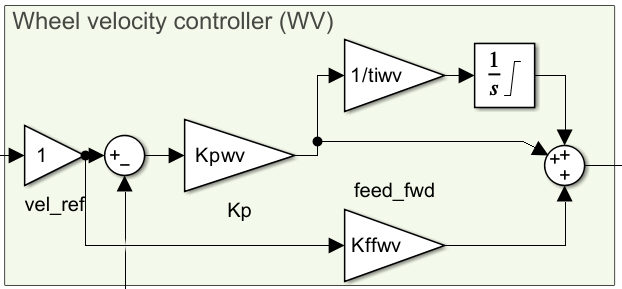
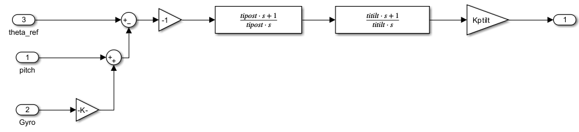

# REGBOT MATLAB & Simulink Walkthrough

> [!abstract] Purpose
> A companion document built up as we read through the MATLAB design scripts
> and the Simulink model. Not a redesign — the v3 numerical content in the
> repo is the validated truth (hardware-tested 2026-04-22). This document
> explains **what the code does and why**, with slide references and
> NotebookLM-verified citations attached to every concrete claim.
> Verification is automated: Claude consults the `lcd1` NotebookLM notebook
> (loaded with all 12 lecture slides + MATLAB exercises, 40 sources) via the
> `nlm.bat` CLI when filling in this document, and embeds the cited finding
> inline. You read the verified statement; the verification step itself
> happens during the walkthrough conversation.

---

## How to use this document

### Reading flow

Sections are filled in **as we walk through each script in conversation**. An
empty section header just means we haven't gotten there yet.

Within a script section, each step contains:

1. **Code block** — the actual MATLAB excerpt for that step, with the line
   range in the heading so you can jump straight into the script.
2. **Prose explanation** — what the code does, what the math says, why this
   step exists at this point in the recipe.
3. **Claim → cited verification pairs** — every concrete assertion about
   control theory is followed by a `> [!cite]` callout containing the
   NotebookLM-grounded quote + slide/page reference.
4. **Slide refs** — links to the specific slide pages backing the step.

### How verification works

Claims in this document are grounded in the user's actual course material,
not Claude's general training data. The mechanism:

- The `lcd1` NotebookLM notebook is pre-loaded with the 12 lecture PDFs and
  the MATLAB exercise material (40 sources total). It lives at notebook ID
  `dcddcf87-0a72-40eb-afae-7dab260350e8` (alias `lcd1`).
- While filling in this document, Claude runs:
  ```
  C:\Users\Mads2\.claude\skills\notebooklm\scripts\nlm.bat ask "<question>" --notebook-id lcd1
  ```
  for each concrete claim. The returned answer is grounded in the slides
  and exercises, with NotebookLM's own citations to source documents.
- Claude copies the cited finding into a `> [!cite]` callout next to the
  claim, including the slide/page reference NotebookLM gave back.

Three possible outcomes per claim, marked accordingly in the callout:

- ✅ **Confirmed** — sources back the claim. Quote + slide ref shown.
- ✏️ **Corrected** — sources contradict the claim. The corrected version is
  what appears in this document; the original wrong version is noted in
  the callout so the reasoning is traceable.
- ❔ **Not in sources** — claim is general control-theory knowledge not
  specifically covered in `lcd1`. Marked as such; user should treat it as
  Claude's reasoning, not as sourced fact.

If you want to re-verify a claim yourself, copy the claim text and run
the same `nlm.bat ask` command — the question that produced the citation
is reconstructable from the claim, so the doc doesn't preserve the prompt
separately.

### Slide link format

Links use Obsidian's URI scheme (`obsidian://open?vault=Obsidian&file=...`)
so they resolve from anywhere on disk — this document doesn't have to live
inside the vault. Clicking launches Obsidian and opens the target file.
Path components are URL-encoded (`/` → `%2F`, space → `%20`, `&` → `%26`).
Example:

```markdown
[Lec 8 · slide 12 — PI zero placement](obsidian://open?vault=Obsidian&file=Courses%2F34722%20Linear%20Control%20Design%201%2FSlides%2FLecture_08_PI_LEAD_design.pdf)
```

The `obsidian://` URI doesn't carry a page anchor, so the slide number lives
in the link text — Obsidian opens the PDF, you scroll to the cited slide.

### Template for a step (copy this when filling in)

````markdown
### X.Y Step N — Title   *(lines aa–bb)*

```matlab
% code excerpt
```

Prose explanation of what this step does and why.

**Claim:** A concrete statement about the math/control theory.

> [!cite] ✅ Verified — Lecture N · slide M
> > Direct quote from the slide/exercise as returned by NotebookLM.
>
> *Source: `lcd1` notebook, `<filename>.pdf` slide M (cited by NotebookLM).*

**Slide refs**
- [Lec N · slide M — topic](obsidian://open?vault=Obsidian&file=Courses%2F34722%20Linear%20Control%20Design%201%2FSlides%2F<filename>.pdf)
````

Variants of the `[!cite]` callout for the other two outcomes:

````markdown
> [!cite] ✏️ Corrected — Lecture N · slide M
> **Original wrong claim:** "<the claim before NotebookLM corrected it>"
> **What the sources actually say:**
> > Direct quote.
>
> *Source: `lcd1` notebook, `<filename>.pdf` slide M.*

> [!cite] ❔ Not in `lcd1` sources
> Claim could not be located in the loaded slides or exercises. Treat as
> Claude's general control-theory reasoning, not as sourced fact.
````

---

## Source map

### MATLAB scripts (in this repo)

| Script | Role |
|---|---|
| `simulink/regbot_mg.m` | Workspace loader — physical params, committed gains, addpath |
| `simulink/design_task1_wheel.m` | Wheel-speed PI design |
| `simulink/design_task2_balance.m` | Method 2 PILead + post-PI (the tilt controller) |
| `simulink/design_task3_velocity.m` | Velocity PI design |
| `simulink/design_task4_position.m` | Position P design |
| `simulink/regbot_1mg.slx` | Simulink model (cascade + Simscape plant) |
| `simulink/lib/pick_image_dir.m` | Helper — returns `docs/images/` |
| `simulink/lib/save_plot.m` | Helper — figure → title → saveas |
| `simulink/lib/print_tf.m` | Helper — pretty-print a transfer function |
| `simulink/lib/poly_to_str.m` | Helper — used by `print_tf` |

### Lecture slides (in Obsidian vault)

| # | Title |
|---|---|
| 1 | [Welcome](obsidian://open?vault=Obsidian&file=Courses%2F34722%20Linear%20Control%20Design%201%2FSlides%2F1_Welcome_Lecture.pdf) |
| 2 | [Block diagrams & control concepts](obsidian://open?vault=Obsidian&file=Courses%2F34722%20Linear%20Control%20Design%201%2FSlides%2F2_block_control_concept.pdf) |
| 3 | [Laplace & transfer functions](obsidian://open?vault=Obsidian&file=Courses%2F34722%20Linear%20Control%20Design%201%2FSlides%2F3_Laplace_TF.pdf) |
| 4 | [Frequency & time analysis](obsidian://open?vault=Obsidian&file=Courses%2F34722%20Linear%20Control%20Design%201%2FSlides%2F4_Frequency_and_Time_Analysis_NoSol.pdf) |
| 5 | [Modelling](obsidian://open?vault=Obsidian&file=Courses%2F34722%20Linear%20Control%20Design%201%2FSlides%2F5_Modelling.pdf) |
| 6 | [Bode plot & stability](obsidian://open?vault=Obsidian&file=Courses%2F34722%20Linear%20Control%20Design%201%2FSlides%2F6_Bode_plot%26Stability.pdf) |
| 7 | [Nyquist plot & stability](obsidian://open?vault=Obsidian&file=Courses%2F34722%20Linear%20Control%20Design%201%2FSlides%2FLecture_07_Nyquist%20plot%20and%20stability.pdf) |
| 8 | [PI-Lead design](obsidian://open?vault=Obsidian&file=Courses%2F34722%20Linear%20Control%20Design%201%2FSlides%2FLecture_08_PI_LEAD_design.pdf) |
| 9 | [PI-Lead design with specifications](obsidian://open?vault=Obsidian&file=Courses%2F34722%20Linear%20Control%20Design%201%2FSlides%2FLecture_09_PI_LEAD_design_specifications.pdf) |
| 10 | [Unstable systems](obsidian://open?vault=Obsidian&file=Courses%2F34722%20Linear%20Control%20Design%201%2FSlides%2FLecture_10_Unstable_systems.pdf) |
| 11 | [Limited systems](obsidian://open?vault=Obsidian&file=Courses%2F34722%20Linear%20Control%20Design%201%2FSlides%2FLecture_11_Limited_systems.pdf) |
| 12 | [Disturbances, sensitivity, prefilters](obsidian://open?vault=Obsidian&file=Courses%2F34722%20Linear%20Control%20Design%201%2FSlides%2FLecture_12_Disturbances_sensitivity_prefilters.pdf) |

### Lesson notes (in Obsidian vault)

Located at `Obsidian/Courses/34722 Linear Control Design 1/Lecture Notes/`. Markdown
notes are linked without the `.md` extension (Obsidian convention).

- [Fundamentals – Intuitive Control Theory](obsidian://open?vault=Obsidian&file=Courses%2F34722%20Linear%20Control%20Design%201%2FLecture%20Notes%2FFundamentals%20-%20Intuitive%20Control%20Theory)
- [Diagnostic Guide – What Went Wrong](obsidian://open?vault=Obsidian&file=Courses%2F34722%20Linear%20Control%20Design%201%2FLecture%20Notes%2FDiagnostic%20Guide%20-%20What%20Went%20Wrong)
- [Lesson 2 – Block Diagrams and Control Concepts](obsidian://open?vault=Obsidian&file=Courses%2F34722%20Linear%20Control%20Design%201%2FLecture%20Notes%2FLesson%202%20-%20Block%20Diagrams%20and%20Control%20Concepts)
- [Lesson 3 – Laplace Transform and Transfer Functions](obsidian://open?vault=Obsidian&file=Courses%2F34722%20Linear%20Control%20Design%201%2FLecture%20Notes%2FLesson%203%20-%20Laplace%20Transform%20and%20Transfer%20Functions)
- [Lesson 4 – Frequency Domain and Time Analysis](obsidian://open?vault=Obsidian&file=Courses%2F34722%20Linear%20Control%20Design%201%2FLecture%20Notes%2FLesson%204%20-%20Frequency%20Domain%20and%20Time%20Analysis)
- [Lesson 8 – Position Controller Design](obsidian://open?vault=Obsidian&file=Courses%2F34722%20Linear%20Control%20Design%201%2FLecture%20Notes%2FLesson%208%20-%20Position%20Controller%20Design)
- [Lesson 9 – PI-Lead Design with Specifications](obsidian://open?vault=Obsidian&file=Courses%2F34722%20Linear%20Control%20Design%201%2FLecture%20Notes%2FLesson%209%20-%20PI-Lead%20Design%20with%20Specifications)
- [Lesson 10 – Unstable Systems and REGBOT Balance](obsidian://open?vault=Obsidian&file=Courses%2F34722%20Linear%20Control%20Design%201%2FLecture%20Notes%2FLesson%2010%20-%20Unstable%20Systems%20and%20REGBOT%20Balance)
- [Worked Example – REGBOT Position Controller](obsidian://open?vault=Obsidian&file=Courses%2F34722%20Linear%20Control%20Design%201%2FLecture%20Notes%2FWorked%20Example%20-%20REGBOT%20Position%20Controller)

---

## 1. `regbot_mg.m` — workspace loader  *(skim)*

> [!success] Status: walked 2026-05-12 — kept brief on purpose

**File:** `simulink/regbot_mg.m`

Plumbing, not design. The script loads the assignment-given physical
parameters (motor specs, geometry, masses) and the committed v3 gains
into the MATLAB base workspace, and adds `simulink/` + `simulink/lib/`
to the path. Nothing in here is something we *design* — the parameters
are given, and the gains are produced by the four `design_task*.m`
scripts that print copy-pasteable blocks back into this file.

Workflow:

1. Open MATLAB, run `regbot_mg` (or let Simulink's PreLoadFcn do it).
2. Run a design script. It uses the workspace, computes new gains,
   prints them.
3. Paste the new block into the "Committed controller gains" section of
   `regbot_mg.m` and re-run it before designing the next outer loop.

The only two values worth noting before moving on (because they recur in
later sections):

- `Kemf = Km = 0.0105`  — DC motor convention (back-EMF constant equals
  torque constant in SI units; standard result from Lec 2).
- `twvlp = 0.005 s` — first-order low-pass on the wheel-velocity
  feedback. Break frequency 200 rad/s, far above any loop crossover, so
  it adds negligible phase at the bandwidths we care about while
  attenuating encoder quantization noise.

All the gain blocks at lines 66–114 are the meaningful output of
§2–§5 — we unpack each one there.

### Committed controller gains  *(lines 66–114)*

The canonical source of truth for the v3 gains. Reference table for the
whole document — every gain mentioned in later sections traces back to
one of these rows.

| Task | Variable | Value | Loop | Source script |
|---|---|---|---|---|
| 1 | `Kpwv` | 13.2037 | Wheel-speed PI — proportional | `design_task1_wheel.m` |
| 1 | `tiwv` | 0.1000 s | Wheel-speed PI — integral time | `design_task1_wheel.m` |
| 1 | `Kffwv` | 0 | Wheel-speed feed-forward | `design_task1_wheel.m` |
| 2 | `Kptilt` | 1.1999 *(firmware: **−1.1999**)* | Balance — proportional | `design_task2_balance.m` |
| 2 | `titilt` | 0.2000 s | Balance — integral time | `design_task2_balance.m` |
| 2 | `tdtilt` | 0.0442 s | Balance — Lead time constant | `design_task2_balance.m` |
| 2 | `tipost` | 0.1245 s | Balance — post-integrator zero | `design_task2_balance.m` |
| 3 | `Kpvel` | 0.1581 | Velocity PI — proportional | `design_task3_velocity.m` |
| 3 | `tivel` | 3.0000 s | Velocity PI — integral time | `design_task3_velocity.m` |
| 4 | `Kppos` | 0.5411 | Position — proportional | `design_task4_position.m` |
| 4 | `tdpos` | 0 *(Lead dropped)* | Position — Lead time constant | `design_task4_position.m` |

Two things to flag now, expanded later:

- **Task 2 sign flip.** `Kptilt = 1.1999` in MATLAB, but the firmware
  `[cbal] kp` entry in `config/regbot_group47.ini` is `−1.1999`. The
  firmware Balance block does not absorb Method 2's `−1`. Positive `kp`
  on the robot runs the wheels into a positive-feedback runaway. We
  cover the Method 2 sign-flip in §3.
- **Task 4 killed Lead.** `tdpos = 0` because a pure Lead `(τs + 1)` is
  improper and Simulink rejects it; adding `1/(ατs + 1)` would make it
  proper at the cost of a noisy fast pole, not worth ~3° of PM at
  ω_c = 0.6 rad/s. Covered in §5.

---

## 2. `design_task1_wheel.m` — wheel-speed PI

> [!success] Status: walked 2026-05-13

**File:** `simulink/design_task1_wheel.m`
**Plant:** `Gvel(s) = 2.198 / (s + 5.985)`  *(Day 5 v2 on-floor 1-pole fit, loaded from `data/Day5_results_v2.mat` as `G_1p_avg`)*
**Specs:** ω_c = 30 rad/s, γ_M ≥ 60°, Ni = 3
**Result:** `Kpwv = 13.2037`, `tiwv = 0.1`

The wheel-speed loop is the innermost loop of the cascade — the one the
balance, velocity, and position loops all sit on top of and assume "just
works". The script walks the textbook PI design recipe step-by-step (one
figure per intermediate stage) so the *design decisions* are visible, not
buried in a single `pidtune` call.

### 2.1 Step 1 — Inspect the plant   *(lines 37–58)*

```matlab
S         = load(mat_path, 'G_1p_avg');
Gvel_day5 = S.G_1p_avg;     % 2.198 / (s + 5.985)

p_plant = pole(Gvel_day5);
K_DC    = dcgain(Gvel_day5);
omega_b = -p_plant(1);          % break frequency = -pole (rad/s)
tau_p   = 1/omega_b;            % time constant   = 1/break
```

Loads the averaged on-floor 1-pole `tfest` fit and reads off the three
numbers that summarise a first-order plant:

| Quantity | Value | Meaning |
|---|---|---|
| `K_DC` | ≈ 0.367 (m/s)/V | Steady-state wheel speed per volt of motor command |
| `omega_b` | 5.985 rad/s | Break frequency — phase is at −45° and magnitude at −3 dB |
| `tau_p` | ≈ 0.167 s | Time constant — 63% of a step in 0.167 s |

This is plant-ID output, not design output — the numbers come from
fitting log data, and `regbot_mg.m` already loaded them; this step just
makes them visible. The Bode plot at figure 190 confirms the textbook
first-order shape: flat below the break, −20 dB/dec roll-off above,
phase going from 0° to −90°. With this in hand, we know the "raw
material" the PI will be shaping.

### 2.2 Step 2 — Pick specs   *(lines 61–76)*

```matlab
wc_wv        = 30;       % target crossover [rad/s]
gamma_M_spec = 60;       % phase margin spec [deg]
Ni_wv        = 3;        % PI zero at wc/Ni
```

Three knobs, picked once, drive every later number in this script.

**ω_c = 30 rad/s** — the bandwidth choice. Bounded below by the cascade
requirement (must be faster than Task 2's balance loop at 15 rad/s so
the outer loop can treat this one as ideal), and bounded above by noise
and motor saturation (every dB above the plant break at 5.985 rad/s
costs proportional gain). 30 rad/s sits ~5× above the plant break and
2× above the next outer loop — comfortably inside both bounds.

**Claim:** LCD1 teaches the cascade design order as *inner-first* —
each outer loop assumes the inner is already fast and accurate enough
to be treated as ideal — but does not pin down a specific numerical
separation ratio (no "≥ 5×" or "≥ 10×" rule). The conceptual
requirement is just that the inner loop's dynamics be negligible at
the outer loop's bandwidth.

> [!cite] ✅ Verified — *Fundamentals - Intuitive Control Theory*
> > "Always Design Inner Loops First. […] The velocity controller needs
> > the tilt loop to already work, because it assumes 'I ask for tilt
> > θ_ref, I get tilt θ.' Likewise the position controller assumes the
> > velocity loop tracks v_ref. Tune inner → middle → outer."
>
> *Source: `lcd1` notebook, `Fundamentals - Intuitive Control Theory.md`
> (cited by NotebookLM). NotebookLM confirmed no specific quantitative
> separation rule appears in the loaded LCD1 material — the "≥ 2×" /
> "≥ 5×" framing is general-control-theory practice applied on top of
> the course's qualitative requirement.*

**γ_M ≥ 60°** — the stability cushion. The course-default 60° gives a
predictable transient: well-damped, ~10% step overshoot, robust to the
kind of plant uncertainty you get from a `tfest` fit.

**Claim:** A phase margin of ≈ 60° corresponds to roughly 10 % step
overshoot.

> [!cite] ✅ Verified — *Worked Example*, *Diagnostic Guide*, and *Fundamentals*
> > "Expected results: Phase margin ≈ 60°, Overshoot ≈ 10–17%."
> > — *Worked Example - REGBOT Position Controller*
> >
> > "Overshoot is directly related to phase margin: 75° → ~2 %; 65° → ~5 %;
> > 55° → ~12 %; 45° → ~23 %; 35° → ~35 %."
> > — *Diagnostic Guide - What Went Wrong*
> >
> > "γ_M ≈ 100·ζ degrees (for ζ < 0.7) […] M_p = exp(−π·ζ/√(1−ζ²))."
> > — *Fundamentals - Intuitive Control Theory*, giving the underlying math
>
> *Source: `lcd1` notebook — three notes triangulate to ~10 % overshoot
> for γ_M = 60°. Plugging ζ ≈ 0.6 into the M_p formula gives 9.5 %,
> matching the Diagnostic Guide interpolation between 65° → 5 % and
> 55° → 12 %.*

**Ni = 3** — the PI zero-placement factor. Sets `τ_i = Ni/ω_c`. Higher
Ni means the PI zero sits further below ω_c, so by the time you're at
ω_c the zero has done more of its phase recovery — the PI eats less
phase margin, but the integral region (where the PI delivers high gain)
is shorter. Lower Ni keeps strong integral action close to ω_c but pays
in phase margin. Ni = 3 is the course default sweet spot: it costs only
18° of phase at ω_c (see Step 3) while still preserving a respectable
integral region from ω_c/3 downward.

### 2.3 Step 3 — Place the PI zero   *(lines 79–99)*

```matlab
tau_i_wv   = Ni_wv / wc_wv;
C_PI_shape = (tau_i_wv*s + 1) / (tau_i_wv*s);   % PI with Kp = 1
```

`τ_i = Ni / ω_c = 3 / 30 = 0.1 s`, putting the PI zero at 10 rad/s —
one decade below ω_c. The PI shape has two regimes:

- **Below the zero (ω < 1/τ_i = 10 rad/s)** — the `1/(τ_i s)` integrator
  dominates: magnitude slope −20 dB/dec, phase flat at −90°. This is
  the integral-action region: high gain at DC, zero steady-state error
  to step references.
- **Above the zero (ω > 10 rad/s)** — the zero's +20 dB/dec slope
  cancels the integrator: magnitude flat (at unity, before `Kp`), phase
  climbing back toward 0°.

At ω_c = 30 rad/s we sit one decade above the zero, well into the
recovery region. The PI's exact phase contribution at ω_c is what
decides whether the natural PM survives the PI insertion or needs a
Lead to claw back.

**Claim:** A PI controller with its zero placed at ω_c/Ni contributes
phase `arctan(Ni) − 90°` at ω_c. For Ni = 3 this is `arctan(3) − 90°
≈ −18.4°`.

> [!cite] ✏️ Corrected — Lecture 8 slides and *Fundamentals*
> **Original wrong claim** *(verbatim from the script comment at line 84
> of `design_task1_wheel.m`):*
> "`-arctan(Ni) - 90 = -18.4 deg for Ni=3`."
> — Numerically this expression evaluates to `−71.57° − 90° = −161.57°`,
> not −18.4°. The sign on the arctan is wrong. The script's actual
> computation goes through `bode()`, not the formula in the comment, so
> the numerical results (and the committed gains) are unaffected — only
> the comment is misleading.
>
> **What the sources actually say:**
> > "Compute the PI phase at the crossover frequency using the formula
> > `φ_PI = arctan(N_i) − 90°`."
> > — *Fundamentals - Intuitive Control Theory*
> >
> > Worked Example, REGBOT Position Controller: `φ_PI = arctan(ω_c·τ_i)
> > − 90° = arctan(3) − 90° = −18.4°`.
> >
> > Lecture 8 derives the equivalent form `φ_i = −arctan(1/N_i)` by
> > evaluating `(1 + jτ_i ω) / (j τ_i ω)` at `s = jω_c` with
> > `τ_i ω_c = N_i`, yielding `∠(1 − j/N_i) = −arctan(1/N_i)`.
>
> *Source: `lcd1` notebook — `Lecture_08_PI_LEAD_design.pdf`,
> `Fundamentals - Intuitive Control Theory.md`,
> `Worked Example - REGBOT Position Controller.md`, and
> `Lesson 8 - Position Controller Design.md` (all cited by NotebookLM).
> Both forms are mathematically identical: arctan(3) − 90° =
> −arctan(1/3) = −18.43°.*

That −18.4° is the price of inserting the PI. The plant alone at 30
rad/s has phase `−arctan(30/5.985) ≈ −78.7°`, so the combined PI·G
phase at ω_c is roughly `−78.7° − 18.4° = −97.1°`, predicting a natural
phase margin of `180° − 97.1° = 82.9°` — well above the 60° spec. Step
4 verifies this numerically.

**Slide refs**
- [Lec 8 — PI-Lead design (derivation of φ_i = −arctan(1/N_i))](obsidian://open?vault=Obsidian&file=Courses%2F34722%20Linear%20Control%20Design%201%2FSlides%2FLecture_08_PI_LEAD_design.pdf)
- [Fundamentals – Intuitive Control Theory](obsidian://open?vault=Obsidian&file=Courses%2F34722%20Linear%20Control%20Design%201%2FLecture%20Notes%2FFundamentals%20-%20Intuitive%20Control%20Theory)
- [Worked Example – REGBOT Position Controller (numerical Ni = 3 example)](obsidian://open?vault=Obsidian&file=Courses%2F34722%20Linear%20Control%20Design%201%2FLecture%20Notes%2FWorked%20Example%20-%20REGBOT%20Position%20Controller)
- [Lesson 8 – Position Controller Design](obsidian://open?vault=Obsidian&file=Courses%2F34722%20Linear%20Control%20Design%201%2FLecture%20Notes%2FLesson%208%20-%20Position%20Controller%20Design)

### 2.4 Step 4 — Phase balance   *(lines 102–135)*

```matlab
[magL_unscaled, phi_L_wc] = bode(C_PI_shape*Gvel_day5, wc_wv);
magL_unscaled   = squeeze(magL_unscaled);
phi_L_wc        = squeeze(phi_L_wc);
gamma_M_natural = 180 + phi_L_wc;
```

"Phase balance" is the decision point: does the combined `PI · G` phase
at ω_c leave enough margin on its own, or do we need a Lead element to
add positive phase back?

The script reads the combined Bode at the single point `ω = ω_c`
(`bode` called with a scalar frequency returns scalar magnitude and
phase) and computes the *natural* phase margin — natural meaning "what
the PM would be if we set Kp now without any Lead." From the Step-3
estimate this should be ~82–83°.

The decision rule is a one-liner:

- If `γ_M_natural ≥ γ_M_spec` → no Lead needed.
- If `γ_M_natural < γ_M_spec` → Lead must make up the gap
  `γ_M_spec − γ_M_natural` (the classic "PILead" path used in Task 2).

For this loop the natural PM is ~83° vs spec 60°, so no Lead — the
controller stays a pure PI. Task 2's plant has both lower phase and a
right-half-plane pole, which forces the Lead step; we'll revisit that
in §3.

Figure 192 visualises the decision: the magnitude/phase plot of the
combined PI·G with two reference lines — a red vertical at ω_c showing
where the crossover will be after scaling, and a green horizontal at
`−180° + γ_M_spec = −120°` showing the "must stay above" line for the
phase. If the phase curve is above the green line at the red vertical,
we have margin. (The MATLAB plumbing at lines 126–133 — `findall(gcf,
'type', 'axes')` returns most-recent-first, so phase is `ax_all(1)`
and magnitude is `ax_all(2)` — is just how Control System Toolbox
stacks the two subplots in a `bode` figure. Worth knowing if you ever
want to annotate a Bode plot from a script.)

### 2.5 Step 5 — Solve Kp   *(lines 138–149)*

```matlab
Kp_wv = 1 / magL_unscaled;

C_wv = Kp_wv * C_PI_shape;
L_wv = C_wv * Gvel_day5;
```

The PI's phase has already been set by τ_i (Step 3). The proportional
gain `Kp` is a flat, frequency-independent multiplier — on the Bode
plot it shifts the entire magnitude curve up or down by a constant
number of dB without touching the phase at all. So `Kp` doesn't affect
*where on the phase curve ω_c sits*; it only affects *where on the
frequency axis the magnitude crosses 0 dB*.

Pick `Kp` so the open-loop magnitude crosses 1 (= 0 dB) at exactly the
chosen ω_c. With the PI shape evaluated at ω_c (call this
`|L|_unscaled`), the unique `Kp` that places crossover at ω_c is
`Kp = 1 / |L|_unscaled`.

**Claim:** In Bode loop-shaping, the proportional gain is set by the
magnitude condition `K_p = 1 / |C_shape(jω_c) · G(jω_c)|`, where
`C_shape` is the non-proportional part of the controller (the PI /
PILead / etc. with `K_p = 1`).

> [!cite] ✅ Verified — Lecture 8 slides, Lesson 8 / 10 notes, Worked Example
> > Lecture 8 (PI-Lead design):
> > `K_P = 1 / |C_PI(s) · C_D(s) · G(s)|  at  s = jω_c`.
> >
> > Lesson 8 (step-by-step PI-Lead procedure): same formula, plus a
> > simpler PI-only form `K_p = 1 / |K_PI(jω_c) · G(jω_c)|`.
> >
> > Worked Example: "Evaluate `|L(jω_c)|` with K_p = 1 first, then set
> > `K_p = 1 / |L(jω_c)|_{K_p=1}`."
> >
> > Lesson 10 (PI for unstable plants): same formula, confirming the
> > magnitude condition is universal regardless of whether the plant
> > is open-loop stable.
>
> *Source: `lcd1` notebook — `Lecture_08_PI_LEAD_design.pdf`,
> `Lesson 8 - Position Controller Design.md`,
> `Worked Example - REGBOT Position Controller.md`, and
> `Lesson 10 - Unstable Systems and REGBOT Balance.md` (all cited by
> NotebookLM).*

For this loop: `|L|_unscaled ≈ 0.0758`, giving `Kp_wv = 1 / 0.0758
≈ 13.20`. That matches the committed value `Kpwv = 13.2037` exactly.

**Slide refs**
- [Lec 8 — PI-Lead design (magnitude condition)](obsidian://open?vault=Obsidian&file=Courses%2F34722%20Linear%20Control%20Design%201%2FSlides%2FLecture_08_PI_LEAD_design.pdf)
- [Lesson 8 – Position Controller Design](obsidian://open?vault=Obsidian&file=Courses%2F34722%20Linear%20Control%20Design%201%2FLecture%20Notes%2FLesson%208%20-%20Position%20Controller%20Design)
- [Lesson 10 – Unstable Systems and REGBOT Balance](obsidian://open?vault=Obsidian&file=Courses%2F34722%20Linear%20Control%20Design%201%2FLecture%20Notes%2FLesson%2010%20-%20Unstable%20Systems%20and%20REGBOT%20Balance)

### 2.6 Step 6 — Verify   *(lines 152–168)*

```matlab
[GM, PM, ~, wc_ach] = margin(L_wv);
```

`margin(L)` is the consistency check. It recomputes ω_c, GM, and PM
from the scaled open-loop `L = Kp · C_shape · G`. If Steps 3–5 were
done right, the printed values match the spec:

- `wc_ach = 30 rad/s` — the magnitude condition (Step 5) enforces this
  by construction.
- `PM = 82.85°` — predicted in Step 4, confirmed here. (The hand-estimate
  was ~83° from the rough phase arithmetic; `bode()` gives the exact
  82.85°.)
- `GM = ∞ dB` — a first-order plant in series with a PI has two poles
  and one zero, so the open-loop phase asymptotes at −180° but never
  crosses. Hence infinite gain margin — the loop can't be destabilised
  by a pure gain bump.

Figures 200 (Bode with margin annotations) and 201 (closed-loop step
response) are the report deliverables — the same plots live in
`docs/images/regbot_task1_bode.png` and `regbot_task1_step.png`.

### 2.7 Hand back to the workspace   *(lines 171–179)*

```matlab
Kpwv  = Kp_wv;     % 13.2037
tiwv  = tau_i_wv;  %  0.1000
Kffwv = 0;
```

Pushes the three values into the base workspace under the names
`regbot_mg.m`'s gains block and the Simulink model expect. The script
prints them in a copy-pasteable block so they can be lifted into the
"Committed controller gains" section of `regbot_mg.m` and into
`config/regbot_group47.ini` for the firmware.

`Kffwv = 0` (feed-forward off) — the PI's integrator already delivers
zero steady-state error, and feed-forward on the wheel-speed loop would
need a plant inverse that's noise-sensitive above the break frequency.

> [!summary] §2 takeaways
> - **One real bug found and fixed.** The script comment at line 84 had
>   the wrong sign on the PI-phase formula: `-arctan(Ni) - 90` should
>   read `arctan(Ni) - 90` (or equivalently `−arctan(1/Ni)`). The
>   numerical computation was unaffected because it goes through
>   `bode()`, not the formula in the comment, so the committed gains
>   are correct. **Fix applied in this session** (a one-line edit to
>   the comment).
> - **Design is over-margined on purpose.** Natural PM = 82.85° vs spec
>   60°. The slack is intentional: the plant fit has uncertainty, and
>   the loop is the foundation of the cascade, so being conservative
>   here doesn't cost the outer loops anything.
> - **Three design rules used here come back later.** PI phase formula
>   (Step 3) → reappears in Task 2's PILead. Magnitude condition
>   (Step 5) → universal across every loop in the cascade. γ_M ↔
>   overshoot rule (Step 2) → carries through Tasks 2–4 as the standard
>   target.

---

## 3. `design_task2_balance.m` — Method 2 PILead + post-PI

> [!success] Status: walked 2026-05-13

**File:** `simulink/design_task2_balance.m`
**Plant:** Linearised vel_ref → tilt (7th order, 1 RHP pole, 1 RHP zero)
**Specs:** ω_c = 15 rad/s, γ_M ≥ 60°, Ni = 3
**Result:** `Kptilt = 1.1999` *(firmware sign-flipped: **−1.1999**)*, `titilt = 0.2`, `tdtilt = 0.0442`, `tipost = 0.1245`

This is the hard one. The balance plant is **open-loop unstable**: the
inverted pendulum has one right-half-plane pole (the "falling" mode).
A vanilla PI-Lead loop-shaping can't stabilise it because no choice of
positive gain can make the Nyquist plot of `Gtilt` encircle `−1`
counter-clockwise. The course's answer is **Method 2** from Lecture 10
(slides on "Stabilization & control of open-loop unstable systems"):
absorb a sign flip into the plant, prepend a "post-integrator" to flatten
the magnitude peak, and *then* run the same PI-Lead loop-shaping recipe
from Task 1 on the reshaped plant.

> [!info] Step mapping: the script vs Lec 10's Method 2
> Lecture 10 officially writes Method 2 as **3 steps**:
>   1. Nyquist sign-check — does `K_PS` need to be negative?
>   2. Reshape with post-integrator and run PI-Lead loop-shaping on `G_s = sign(K_PS) · G`.
>   3. Verify closed-loop and iterate.
>
> The script splits Lec 10's Step 2 into two scripts-level steps
> (post-integrator alone, then PI-Lead) and prepends a "Step 0" for the
> linearisation, giving the five-section layout below. The math is the same;
> the script's layout is pedagogical.
>
> | Script section | Lec 10 Method 2 step |
> |---|---|
> | Step 0 — Identify the plant | (prerequisite — get `G_{tilt}`) |
> | Step 1 — Sign-check K_PS    | Step 1 |
> | Step 2 — Post-integrator    | Step 2 (first half) |
> | Step 3 — Outer PI-Lead      | Step 2 (second half) |
> | Step 4 — Verify             | Step 3 |

### 3.1 Step 0 — Identify the plant   *(lines 37–131)*

```matlab
Kptilt = 0;       % breaks balance loop at the Kptilt gain
tdtilt = 0;       % silences the gyro Lead path
titilt = 1;       % benign TF placeholder
tipost = 1;       % benign TF placeholder

io_tilt(1) = linio([model '/vel_ref'],            1, 'openinput');
io_tilt(2) = linio([model '/robot with balance'], 1, 'openoutput');
setlinio(model, io_tilt);
sys_tilt   = linearize(model, io_tilt, 0);
Gtilt      = minreal(tf(num, den));
```

Before linearising, the script zeros the four gains that the balance
controller uses (`Kptilt`, `tdtilt`, `titilt`, `tipost`) so the linearisation
sees the *open* balance loop. The Task 1 wheel-velocity loop stays
closed — `Gtilt` is therefore the plant from `vel_ref → tilt angle`
*with the inner wheel loop already in place*. This is the cascade
design order put into practice: Task 1's loop is "frozen" before we
start designing Task 2.

The linearisation point is `t = 0`, the upright equilibrium θ = 0,
where the inverted-pendulum equations linearise to a state-space model
with one positive eigenvalue. After `ss2tf` + `minreal`, the script
prints:

- **7 poles** — driven by the Simscape Multibody model's internal states.
- **1 RHP pole** at roughly +6 rad/s — the falling mode. Without
  feedback, a small tilt grows as `e^{6t}` until the robot hits the
  floor.
- **1 RHP zero** — the non-minimum-phase signature of the cart-pendulum
  system: to get the body to tilt one way, the wheels must first roll
  the *other* way ("inverse response"). This RHP zero is what caps how
  high you can push the loop crossover before the response becomes
  ugly.

**Claim:** A plant with one open-loop RHP pole (P = 1) cannot be
stabilised by a positive proportional gain alone — the Nyquist
criterion requires `Z = N + P = 0`, so `N = −1` (one CCW encirclement
of `−1`), and positive K only scales the Nyquist plot radially without
flipping which side of `−1` it lies on.

> [!cite] ✅ Verified — Lecture 7 and Lecture 10
> > Lecture 7 introduces the criterion `Z = N + P`, defining N as the
> > net clockwise encirclements of `(−1, 0)` (so one CCW means N = −1).
> >
> > Lecture 10 reinforces it for the REGBOT context: "to achieve a
> > stable closed-loop system (Z = 0) for a plant with one open-loop
> > RHP pole (P = 1), the open-loop Nyquist plot must make exactly one
> > CCW encirclement of (−1, 0)."
> >
> > Lec 10 also has a dedicated slide comparing "Positive K_PS" vs
> > "Negative K_PS" for a plant whose Nyquist lies entirely in the right
> > half-plane: **"no amount of positive gain can move the curve to the
> > left past the −1 point."**
>
> *Source: `lcd1` notebook — `Lecture_07_Nyquist plot and stability.pdf`
> and `Lecture_10_Unstable_systems.pdf` (cited by NotebookLM).*

Figures 100–106 are the plant-ID deliverables: Bode of `Gwv` and
`Gtilt`, pole-zero maps (full + zoomed), and a custom Nyquist of `Gtilt`
with the `(−1, 0)` point marked. The Nyquist is drawn by hand from the
`nyquist()` numeric output instead of via MATLAB's default `nyquistplot`
because the default overlays M-circles and auto-scales in a way that
hides the critical point.

**Slide refs**
- [Lec 7 — Nyquist plot and stability (Z = N + P)](obsidian://open?vault=Obsidian&file=Courses%2F34722%20Linear%20Control%20Design%201%2FSlides%2FLecture_07_Nyquist%20plot%20and%20stability.pdf)
- [Lec 10 — Unstable systems (P = 1 → need N = −1)](obsidian://open?vault=Obsidian&file=Courses%2F34722%20Linear%20Control%20Design%201%2FSlides%2FLecture_10_Unstable_systems.pdf)
- [Lesson 10 — Unstable Systems and REGBOT Balance](obsidian://open?vault=Obsidian&file=Courses%2F34722%20Linear%20Control%20Design%201%2FLecture%20Notes%2FLesson%2010%20-%20Unstable%20Systems%20and%20REGBOT%20Balance)

### 3.2 Step 1 — Sign of K_PS   *(lines 134–152)*

```matlab
if dc > 0
    sign_K = -1;
    sign_reason = 'DC gain > 0 AND P = 1  =>  sign(K_PS) = -1';
else
    sign_K = +1;
    ...
end
```

The DC gain of `Gtilt` comes out **positive** in this design (~+0.7,
because positive `vel_ref` settles to a positive tilt angle once the
inner velocity loop is doing its thing). With `P = 1` and DC > 0, the
Nyquist plot of `Gtilt` starts on the positive real axis and never
sweeps left past `−1` — so no positive `K_PS` can give the required CCW
encirclement.

**Claim:** Multiplying the plant by a negative gain reflects its
Nyquist plot through the origin (180° rotation), and that's the
standard Method-2 manoeuvre for plants whose Nyquist lies entirely on
the right side of the complex plane.

> [!cite] ✅ Verified — Lecture 10 slides
> > "Multiplying by a gain scales the plot radially, but multiplying by
> > a *negative* gain reflects the plot through the origin (a
> > 180-degree rotation)."
> >
> > "A specific slide in Lecture 10 directly compares plots labeled
> > 'Positive K_PS' versus 'Negative K_PS'. It demonstrates that once
> > the negative gain reflects the plot to the left side, the curve
> > crosses the real axis at −0.5. From there, the magnitude of the
> > negative gain must be increased (`|K_PS| > 2`) to stretch the curve
> > past `(−1, 0)` and successfully complete the required CCW
> > encirclement."
>
> *Source: `lcd1` notebook — `Lecture_10_Unstable_systems.pdf`
> (cited by NotebookLM). The "−0.5 → must scale past 2" example is
> Lec 10's pedagogical case; our `Gtilt` is messier but the principle
> is identical.*

The script bakes the `−1` into `sign_K`, then later prepends it to the
controller stack. The chosen `Kp_tilt` will end up positive (1.1999);
the actual closed-loop gain is `sign_K · Kp_tilt = −1.1999`. **This is
where the firmware sign flip comes from** — the Simulink model carries
`sign_K` through the controller, but the firmware's `[cbal] kp` entry
is a single scalar that must already include the minus sign. See §3.6.

### 3.3 Step 2 — Post-integrator   *(lines 155–200)*

```matlab
[mag_peak, k_peak] = max(mag_g);
w_ip       = w_grid(k_peak);
tau_ip     = 1 / w_ip;

C_PI_post  = (tau_ip*s + 1) / (tau_ip*s);
Gtilt_post = sign_K * C_PI_post * Gtilt;
```

Once the sign is sorted, the script attacks the next problem: the
magnitude curve of `Gtilt` *rises* into a resonance peak around 8 rad/s
before rolling off. A plant that gets louder at higher frequencies is
disastrous for robustness — any high-frequency disturbance or noise is
amplified more than a DC error. So before designing the outer
controller, the magnitude is reshaped by a **post-integrator**: a
standard PI whose zero is placed exactly at the magnitude peak.

The script finds the peak by scanning a log-spaced grid of `|Gtilt(jω)|`
values and picking the argmax. For the v3 plant the peak sits at
`ω_i,post ≈ 8.03 rad/s`, giving `τ_i,post = 1/8.03 ≈ 0.1245 s` — the
committed `tipost`.

**Claim:** The post-integrator zero is placed at the frequency where
the unstable plant's magnitude peaks (`τ_i,post = 1/ω_peak`), so the
PI's `+20 dB/dec` zero cancels the rising slope into the resonance
and leaves a monotonically decreasing combined magnitude.

> [!cite] ✅ Verified — Lecture 10, slide 23
> > "To find the post-integrator time constant τ_{i,post}:
> > Make a Bode plot of G_tv(s).
> > Find the location ω_{i,post} of the magnitude peak.
> > Select τ_{i,post} = 1/ω_{i,post}."
> >
> > Why: "The unstable plant initially has a rising magnitude curve,
> > which is dangerous because it means a proportional gain would have
> > a stronger effect at high frequencies than at DC, severely harming
> > robustness. By placing the post-integrator's zero exactly at this
> > magnitude peak, the rising slope is cancelled out. This leaves the
> > combined transfer function with a monotonically decreasing,
> > well-behaved magnitude curve that can then be successfully
> > controlled by an outer PI-Lead design."
>
> *Source: `lcd1` notebook — `Lecture_10_Unstable_systems.pdf` slide 23
> (cited by NotebookLM).*

The reshaped plant is `Gtilt_post = sign_K · C_PI,post · Gtilt`. After
this transformation:

- **Magnitude** is monotonically decreasing past `ω_i,post`.
- **Nyquist** of `Gtilt_post` makes **one CCW encirclement of `(−1, 0)`** —
  exactly what Z = N + P with P = 1 needs (figure 301). This is the
  Nyquist-level proof that Method 2 has done its job: the reshaped
  plant has the right encirclement count to be stabilised by a positive
  outer gain, just like a regular plant would.

Figure 300 overlays `Gtilt` (blue) and `Gtilt_post` (orange) on the same
Bode plot so the magnitude reshape is visible. Figure 301 is the
hand-drawn Nyquist of `Gtilt_post` with `(−1, 0)` marked and direction
arrows along the ω > 0 branch. The mirror image (dashed) shows the
ω < 0 branch — the Nyquist contour as a whole. Note the curve heads to
infinity at low frequencies because the post-integrator introduced a
free integrator (`1/(τs)` factor); the `w_ny = logspace(-1, 4, ...)`
choice clips the sample frequency window so the auto-axis stays sane,
and explicit `xlim`/`ylim` then focus on the critical-point neighbourhood.

**Slide refs**
- [Lec 10 — Unstable systems (slide 23, post-integrator placement)](obsidian://open?vault=Obsidian&file=Courses%2F34722%20Linear%20Control%20Design%201%2FSlides%2FLecture_10_Unstable_systems.pdf)

### 3.4 Step 3 — Outer PI-Lead   *(lines 203–267)*

```matlab
wc_tilt  = 15;
gamma_M  = 60;
Ni_tilt  = 3;

tau_i_tilt = Ni_tilt / wc_tilt;            % = 0.2 s
C_PI_tilt  = (tau_i_tilt*s + 1) / (tau_i_tilt*s);

[~, phi_G]  = bode(Gtilt_post, wc_tilt);
phi_PI      = -atand(1/Ni_tilt);            % = -18.4 deg
phi_Lead    = -180 + gamma_M - phi_G - phi_PI;

if phi_Lead <= 0
    tau_d  = 0;  C_Lead = tf(1);
elseif phi_Lead >= 89
    tau_d  = NaN; C_Lead = tf(1);
else
    tau_d  = tand(phi_Lead) / wc_tilt;
    C_Lead = tau_d*s + 1;
end

magL    = squeeze(bode(C_PI_tilt * C_Lead * Gtilt_post, wc_tilt));
Kp_tilt = 1 / magL;
```

With the reshaped `Gtilt_post` in hand, the rest is **exactly Task 1's
recipe** — just on a different plant, plus a Lead step that Task 1 was
able to skip:

- **`ω_c = 15 rad/s`** — chosen as half the wheel-speed loop's 30 rad/s
  so the inner loop can be treated as ideal at the balance bandwidth
  (the cascade rule). Higher than the open-loop instability rate
  (~6 rad/s) by ~2.5× — far enough that the controller responds
  faster than the robot can fall.
- **`Ni = 3, γ_M = 60°`** — same defaults as Task 1.
- **`τ_i = Ni/ω_c = 0.2 s`** — outer PI zero, places integral action
  from 5 rad/s downward.
- **PI phase at ω_c:** `−atan(1/Ni) = −18.4°`, same number as Task 1.
- **Phase deficit:** read `phi_G = phase of Gtilt_post at ω_c` from
  `bode()`. The combined phase `phi_G + phi_PI` typically sits well
  below the `−180° + γ_M = −120°` PM line for this plant, so a positive
  `phi_Lead` is needed to close the gap.
- **Lead via the gyro shortcut.** `tau_d = tan(φ_Lead)/ω_c` from the
  one-zero Lead phase formula. The Lead is just `(τ_d s + 1)` — no
  filter pole `1/(α τ_d s + 1)`. This is the **gyro shortcut**: the
  IMU's gyroscope already measures `θ̇`, so the Lead's differentiation
  step doesn't need numerical derivatives or noise-protection
  filtering.

**Claim:** A Lead compensator `(τ s + 1)/(α τ s + 1)` is normally
implemented with both the zero (for phase boost) and the low-pass pole
(to bound the derivative's noise gain). When the controller can read
`θ̇` directly (as REGBOT does via its gyroscope), the low-pass pole
becomes unnecessary, and the Lead reduces to a pure `(τ_d s + 1)`
implemented as the weighted sum `τ_d · gyro + θ`.

> [!cite] ✅ Verified — Lecture 10 slides and *Lesson 10 - Unstable Systems and REGBOT Balance*
> > Lec 10 "Some tips": "For the Lead part of the tilt angle controller
> > you can use the gyro measurement (derivative of tilt angle)." The
> > slide visually labels the `1/(α τ s + 1)` low-pass block as **"Not
> > needed"**.
> >
> > Lesson 10 ("Lead from the Gyro — Skipping the Derivative") gives
> > the math explicitly:
> > > "A standard Lead has the form `(τ s + 1)/(α τ s + 1)`. The
> > > numerator is a derivative, the denominator is a low-pass filter to
> > > keep noise from blowing up. For REGBOT the gyro **already
> > > measures** `θ̇`, so no numerical differentiation is needed.
> > >
> > > `(τ s + 1)/(α τ s + 1) · θ = (1/(α τ s + 1)) · (τ · gyro + θ)
> > >  → τ · gyro + θ`."
> > >
> > > "Because the gyro gives a clean derivative, we drop the low-pass
> > > `1/(α τ s + 1)` and implement the Lead as a simple weighted sum
> > > `τ · gyro + θ`. Cleaner, less phase lag, fewer tuning parameters."
>
> *Source: `lcd1` notebook — `Lecture_10_Unstable_systems.pdf` and
> `Lesson 10 - Unstable Systems and REGBOT Balance.md` (cited by
> NotebookLM).*

- **Magnitude condition:** same formula as Task 1,
  `Kp = 1 / |C_PI · C_Lead · G_post|_{ω_c}`. Yields `Kp_tilt = 1.1999`.

The full controller stack the Simulink model implements is

```
C_total = Kp_tilt · sign_K · C_PI,post · C_PI,tilt · C_Lead
        = (1.1999) · (-1) · (0.1245 s + 1)/(0.1245 s) · (0.2 s + 1)/(0.2 s) · (0.0442 s + 1)
```

Figure 305 visualises the phase-balance check: the Bode of
`C_PI_tilt · C_Lead · Gtilt_post` with a red `ω_c` line and a green PM
line at `−180° + γ_M = −120°`. After the Lead, the phase curve sits
above the green line at the red vertical — by exactly `γ_M = 60°` if
the arithmetic is consistent.

**Slide refs**
- [Lec 10 — Unstable systems ("Some tips": use gyro for Lead)](obsidian://open?vault=Obsidian&file=Courses%2F34722%20Linear%20Control%20Design%201%2FSlides%2FLecture_10_Unstable_systems.pdf)
- [Lesson 10 — Unstable Systems and REGBOT Balance ("Lead from the Gyro")](obsidian://open?vault=Obsidian&file=Courses%2F34722%20Linear%20Control%20Design%201%2FLecture%20Notes%2FLesson%2010%20-%20Unstable%20Systems%20and%20REGBOT%20Balance)
- [Lec 8 — PI-Lead design (the recipe inherited from Task 1)](obsidian://open?vault=Obsidian&file=Courses%2F34722%20Linear%20Control%20Design%201%2FSlides%2FLecture_08_PI_LEAD_design.pdf)

### 3.5 Step 4 — Verify   *(lines 270–308)*

```matlab
T_tilt   = feedback(L_tilt, 1);
cl_poles = pole(minreal(T_tilt));
rhp_cl   = sum(real(cl_poles) > 0);
[GMt, PMt, ~, wct_ach] = margin(L_tilt);

theta0 = deg2rad(10);
S_tilt = feedback(1, L_tilt);
[y_dist, ~] = step(theta0 * S_tilt, t_ic);
```

Three checks, in increasing order of "matches what the robot will
actually do":

1. **Open-loop margins** (`margin(L_tilt)`) — `ω_c`, `PM`, `GM` from the
   scaled `L = K_P · C_PI · C_Lead · G_tilt,post`. Should match the
   spec: `ω_c ≈ 15 rad/s`, `PM ≈ 60°`.
2. **Closed-loop pole check** (`pole(minreal(T_tilt))`) — counts how
   many closed-loop poles sit in the RHP. **The RHP-pole count must be
   zero** for the system to be stable; this is the direct test of
   `Z = 0`, complementing the Nyquist proof from Step 2.
3. **Initial-condition recovery** (figure 304) — drives the linear
   model with a `θ₀ = 10°` initial tilt via the sensitivity transfer
   function `S = 1/(1 + L)`, and plots the recovery. This is the linear
   analogue of the hardware test where the robot is released from a
   tilted position. The script prints the 2 % settling time and the
   peak undershoot.

Figures 302 (Bode with margin annotations), 303 (closed-loop step
response), and 304 (IC release simulation) are the report deliverables.
The IC-release plot is the one to compare against the hardware
recovery log `logs/test3a_balance_rest_v3_onfloor_2026-04-22.txt`.

### 3.6 Hand back to the workspace and the firmware sign flip   *(lines 311–321)*

```matlab
Kptilt = Kp_tilt;          % 1.1999  (positive in MATLAB)
titilt = tau_i_tilt;       % 0.2000
tdtilt = tau_d;            % 0.0442
tipost = tau_ip;           % 0.1245

fprintf('(firmware [cbal] kp must be entered as -%.4f)\n\n', Kptilt);
```

The script ends with an explicit warning printed to the console:
**`firmware [cbal] kp must be entered as -1.1999`**.

The reason traces back to Step 1's `sign_K = -1`. In MATLAB, the sign
is carried through as a separate term in `C_total = Kp · sign_K ·
C_PI,post · C_PI,tilt · C_Lead`. In Simulink, the model's Tilt
Controller subsystem has a literal `-1` gain block between the inner
post-PI and the outer PI-Lead, so `Kptilt` itself stays positive there
too.

But the firmware Balance block (the C code running on the robot's
microcontroller) treats `kp` as a single scalar applied to the tilt
error — **it does not have a separate `sign_K` gain block in the data
flow**. So the firmware's `[cbal] kp` entry must absorb the minus
sign. Set it to `−1.1999`. With positive `+1.1999`, the proportional
feedback is the wrong sign, the wheels accelerate in the direction the
robot is already falling, and the runaway is immediate.

> [!warning] Two-line summary
> - MATLAB / Simulink: `Kptilt = +1.1999`. The sign lives in a `-1` gain block.
> - Firmware (`config/regbot_group47.ini`, `[cbal] kp`): **`−1.1999`**.

> [!summary] §3 takeaways
> - **Method 2 = "fix the sign, fix the magnitude, then run the normal
>   PI-Lead recipe."** Step 1 absorbs the sign so the Nyquist plot can
>   make a CCW encirclement; Step 2 adds a zero at the magnitude peak
>   so the combined plant has monotonically decreasing magnitude; Step 3
>   is then identical to Task 1 plus a Lead.
> - **The Nyquist of `Gtilt_post` (fig. 301) is the visual proof** that
>   Method 2 has done its job — one CCW encirclement of `(−1, 0)` matches
>   `N = −1` for `P = 1`, giving `Z = 0`.
> - **Two checks confirm stability after the design.** The Nyquist
>   encirclement count (graphical, from Step 2) and the closed-loop RHP
>   pole count `rhp_cl = sum(real(cl_poles) > 0) == 0` (algebraic, from
>   Step 4). They must agree.
> - **The gyro-shortcut Lead is the one piece of REGBOT-specific
>   cleverness** in this design — it drops the filter pole because the
>   gyro already provides clean `θ̇`. Lec 10 has a "Not needed" label
>   pointing at the filter pole on the relevant slide.
> - **Firmware sign flip is non-negotiable.** Positive `[cbal] kp` runs
>   the wheels into a positive-feedback runaway. The ini must read
>   `kp = -1.1999`.

---

## 4. `design_task3_velocity.m` — velocity PI

> [!success] Status: walked 2026-05-13

**File:** `simulink/design_task3_velocity.m`
**Plant:** Linearised `θ_ref → wheel_vel_filter` *(Tasks 1+2 closed; stable, but **RHP zero at +8.5 rad/s**)*
**Specs:** ω_c = 1 rad/s, γ_M ≥ 60°, Ni = 3
**Result:** `Kpvel = 0.1581`, `tivel = 3.0` *(ω_c achieved = 1 rad/s, γ_M = 68.98°)*

Same recipe as §2 — Task 1's PI procedure applied to a different plant.
With Tasks 1+2 closed, the plant `θ_ref → v` is now stable (the
post-PI from Task 2 took care of the RHP pole), but a **+8.5 rad/s
non-minimum-phase RHP zero** survives and caps how fast this loop can
respond. Two new design ingredients vs Task 1:

1. **RHP-zero bandwidth limit.** Pushing `ω_c` close to the RHP zero
   kills the achievable phase margin and produces ugly inverse-response
   transients. The script uses `ω_c ≤ z/5` as a safety threshold —
   here `8.5/5 ≈ 1.7 rad/s`, so `ω_c = 1` sits well under. The
   cascade-separation rule (`15/5 = 3 rad/s`) is looser, so the RHP
   zero is the binding constraint.

   > [!cite] ❔ Not in `lcd1` sources
   > The specific `ω_c ≤ z/N` numerical rule (textbook usually
   > `z/2`; the script chose the safer `z/5`) is not in the LCD1
   > slides. The course discusses RHP zeros qualitatively — "well-known
   > challenge", produces inverse response, characteristic undershoot
   > — but never gives a numerical bandwidth bound. Treat this as
   > general control-theory practice, not sourced fact.
   >
   > *Source: `lcd1` notebook returned no matching slide. The
   > inverse-response discussion lives in Lec 10 / Lesson 10 in the
   > REGBOT NMP context but with no `z/k` formula attached.*

2. **Phase-wrap fix at line 132.** For this 9th-order plant
   `bode(...)` returns a phase that's already wrapped past `−180°` by
   the time it gets to `ω_c = 1 rad/s`, but reports it continuously
   unwrapped — possibly as something like `+200°` instead of the
   physical `−160°`. The line
   ```matlab
   phi_L_phys = mod(phi_G_unwrapped + 180, 360) - 180;
   ```
   wraps the angle back to `[−180°, +180°]` so the natural-PM
   calculation `gamma_M_natural = 180 + phi_L_phys` reads correctly.
   Worth knowing if you ever copy this phase-balance pattern into a
   higher-order loop.

The rest of the steps run exactly like Task 1's pattern:

| Step | Section in script | Output |
|---|---|---|
| 0 — Identify plant | lines 44–87 | `Gvel_outer`, prints poles/zeros, fig 402 (PZ map) |
| 1 — Pick specs    | lines 90–112 | `wc = 1`, `γ_M = 60°`, `Ni = 3` |
| 2 — Place PI zero | lines 115–120 | `τ_i = Ni/ωc = 3.0 s` (PI zero at 0.333 rad/s) |
| 3 — Phase balance | lines 123–163 | natural PM ≈ 69° (above 60° spec) → no Lead, fig 403 |
| 4 — Solve Kp      | lines 166–177 | `Kp = 1 / |L|_unscaled = 0.1581` |
| 5 — Verify        | lines 180–194 | `margin(L)` → ωc = 1, PM = 68.98°; figs 400 (Bode), 401 (step) |

`τ_i = 3.0 s` is a much longer integral-action region than Task 1's
`0.1 s` — that's just the scaling: a 30× slower loop has a 30× longer
PI time constant. `Kp = 0.158` is small for the same reason — the plant
is *loud* at `ω_c = 1 rad/s` because Task 2's post-integrator put a
free integrator into the inner-loop transfer function, so `|L|_unscaled`
at `ω = 1` is large and `Kp = 1/|L|` is correspondingly small.

> [!summary] §4 takeaways
> - **No new control-theory machinery** — same recipe as Task 1, applied
>   to a stable outer plant.
> - **The binding bandwidth constraint** is the RHP zero, not the
>   cascade separation rule. Both bounds pointed in the same direction
>   here; whichever was tighter set the upper limit.
> - **Numerical RHP-zero rule (`ω_c ≤ z/5`) is not in LCD1.** The script
>   imports it from general control practice. Worth keeping in mind:
>   the report can cite this as engineering judgment, not as a Lec-X
>   fact.
> - **Watch the phase unwrap on high-order plants.** The `mod(... + 180,
>   360) - 180` line at 132 is essential — drop it and the natural-PM
>   calculation becomes nonsense.

---

## 5. `design_task4_position.m` — position P

> [!success] Status: walked 2026-05-13

**File:** `simulink/design_task4_position.m`
**Plant:** Linearised `pos_ref → x` *(Tasks 1+2+3 closed; **Type-1** — free integrator from v → x)*
**Specs:** ω_c = 0.6 rad/s, γ_M ≥ 60°
**Result:** `Kppos = 0.5411`, `tdpos = 0` *(Lead dropped after PM check)*

Outermost loop. Two things make this section different from §2–§4:

1. **No PI — pure P controller.** The plant already has a free integrator
   (`v → x` is just integration), so the open-loop is **Type-1** before
   the controller adds anything. A bare proportional gain inherits that
   integrator and gets zero steady-state error to a step reference for
   free.

   **Claim:** A Type-1 open-loop transfer function (one free integrator)
   in unity feedback gives zero steady-state error to a step reference,
   even when the controller is a pure P (no integrator of its own).

   > [!cite] ✅ Verified — *Lesson 8 - Position Controller Design* and *Worked Example*
   > > "If the plant itself contains a pure integrator, the open-loop
   > > system is already Type-1. Mathematically, an integrator (`1/s`)
   > > makes the DC gain of the plant infinite (`G(0) = ∞`). When using
   > > the Final Value Theorem to calculate steady-state error for a
   > > P-controller, the formula evaluates to `e_ss = 1 / (1 + K_p · ∞)`,
   > > which equals exactly 0. Intuitively: if there is any constant
   > > error, the single integrator in the loop will accumulate it and
   > > continue to push the control signal up until the error is driven
   > > completely to zero — that's the only point of equilibrium."
   >
   > *Source: `lcd1` notebook — `Lesson 8 - Position Controller Design.md`
   > and `Worked Example - REGBOT Position Controller.md` (cited by
   > NotebookLM). The course notes you'd add an I-term anyway to make
   > the loop Type-2 if you needed zero error on ramp inputs; for a
   > simple position step, P is sufficient.*

2. **`ω_c` chosen against mission specs, not cascade rules.** Tasks 1–3
   all picked `ω_c` from cascade-separation or RHP-zero arguments. Here
   the constraint is a real-world target: drive 2 m, peak v ≥ 0.7 m/s,
   in ≤ 10 s. The script comment records the iteration history:

   | `ω_c` (rad/s) | Peak v (m/s) | Settle (s) | Verdict |
   |---|---|---|---|
   | 0.2 | 0.33 | 20 | FAIL |
   | 0.5 | 0.68 | 12 | close |
   | **0.6** | **~0.82** | **~10** | **CHOSEN** |

   This is engineering iteration, not formula application — the
   cascade rule (`3/5 = 0.6`) happens to land at the same number,
   which is a useful sanity-check but not the reason for the choice.

The five script steps map cleanly:

| Step | Lines | Output |
|---|---|---|
| 0 — Identify plant | 48–83 | `Gpos_outer`, prints `integrators = 1` → "Type-1 (pure P gives e_ss = 0 on step)" |
| 1 — Pick `ω_c`    | 86–98 | `ω_c = 0.6 rad/s`, `γ_M = 60°` |
| 2 — Phase balance | 101–140 | Computes ideal `phi_Lead` from `γ_M - 180 - φ_G` (same phase-wrap fix as Task 3) |
| 3 — Solve `Kp`    | 143–148 | `Kp = 1 / |L|_{ωc} = 0.5411` |
| 4 — Lead decision | 151–182 | Drop if `phi_Lead ≤ 5°`, else proper Lead with `α = 0.1` |
| 5 — Verify        | 185–218 | Margins for both design and firmware controllers; mission-step check |

### The Lead-drop decision   *(lines 151–182)*

A genuine new wrinkle worth highlighting. The phase-balance step
computes an ideal Lead `(τ_d s + 1)` — but this transfer function is
**improper** (numerator degree > denominator degree), and Simulink's
`Transfer Fcn` block refuses to simulate improper systems. Three
implementation options:

| Option | Lead form | Tradeoff |
|---|---|---|
| (a) Ideal | `(τ_d s + 1)` | Theoretical only — Simulink rejects it |
| (b) Proper | `(τ_d s + 1) / (α τ_d s + 1)`, α = 0.1 | Adds a fast filter pole at `1/(α τ_d)`; costs ~3° of PM back vs ideal; amplifies high-frequency noise |
| (c) Drop | `1` (no Lead) | Accept `phi_Lead` degrees of PM cost |

The script picks (c) if the required `phi_Lead ≤ 5°`, else (b).
**Rationale:** for very small phase boosts, a noisy fast pole costs
more (in noise amplification, sensor-jitter, motor whine) than 3–5° of
PM is worth. For this loop the required `phi_Lead` turned out to be
~3° — well under the 5° threshold — so the Lead is dropped and
`tdpos = 0`. The verify step prints both margins side-by-side so the
PM penalty is visible.

This is **course wisdom / engineering judgment, not a slide-citable
rule** — there's no LCD1 lecture that says "drop Lead if it costs less
than 5°." It's a sane default the script enforces; report-time you'd
justify it as "the marginal PM benefit didn't outweigh the
high-frequency noise cost."

> [!summary] §5 takeaways
> - **Type-1 ⇒ P-only is enough.** The free integrator in `v → x`
>   delivers zero steady-state error to a step without a PI; adding an
>   I-term would only help with ramp tracking or disturbance rejection,
>   neither of which is in the mission spec.
> - **The "natural PM" check is the same idea as Task 1's** — read the
>   plant's phase at `ω_c` and see if it already meets spec. For this
>   loop the deficit `phi_Lead` turned out tiny (~3°), so the Lead got
>   dropped on cost-benefit grounds.
> - **`ω_c` here is mission-driven, not formula-driven.** That's the
>   one section in this project where iteration history matters more
>   than a derivation. Keep this in mind when justifying it in the
>   report.

---

## 6. `simulink/regbot_1mg.slx` — the cascade in Simulink

> [!success] Status: walked 2026-05-13 — structural reference only

**File:** `simulink/regbot_1mg.slx`

Binary file — open in Simulink to inspect. This section is a wiring
map: which subsystem implements which controller, and where each
script's gains end up. The physics ("robot with balance") is a
Simscape Multibody assembly; everything outside it is the
four-controller cascade.

### Signal flow (outer → inner → physics)

```
pos_ref ──► [Position P] ──► v_ref
                              │
v_ref ────► [Velocity PI] ──► θ_ref
                              │
θ_ref ────► [Tilt controller chain] ──► vel_ref_wheel
                                         │
vel_ref_wheel ─► [Wheel-velocity PI] ──► motor_voltage
                                         │
motor_voltage ──► [robot with balance] ──► (x, v, θ, gyro, wheel_speed)
                       (Simscape physics)         │
                                                 (feeds back to all 4 loops)
```

### Subsystem → script → gains map

| Simulink block | Script that designed it | Gains | Equation realised |
|---|---|---|---|
| Wheel-velocity PI | `design_task1_wheel.m` | `Kpwv = 13.2037`, `tiwv = 0.1` | `Kpwv · (tiwv·s + 1)/(tiwv·s)` |
| Tilt controller (full chain) | `design_task2_balance.m` | `Kptilt = 1.1999`, `titilt = 0.2`, `tdtilt = 0.0442`, `tipost = 0.1245` | see breakdown below |
| Velocity PI | `design_task3_velocity.m` | `Kpvel = 0.1581`, `tivel = 3.0` | `Kpvel · (tivel·s + 1)/(tivel·s)` |
| Position P | `design_task4_position.m` | `Kppos = 0.5411`, `tdpos = 0` | `Kppos` (Lead block bypassed) |

### Tilt controller — the only non-trivial chain

The Tilt subsystem is what makes the model interesting. From the
tilt-error input to the velocity-reference output, the signal passes
through:

```
θ_err ──► [post-PI: (tipost·s + 1)/(tipost·s)] ──► [×(-1) gain] ──► [outer PI: (titilt·s + 1)/(titilt·s)] ──► [Kptilt] ──┐
                                                                                                                      ├─► Σ ──► vel_ref
            gyro ──► [×tdtilt gain] ────────────────────────────────────────────────────────────────────────────────┘
            θ ───────────────────────────────────────────────────────────────────────────────────────────────────────┘
```

Three things to recognise:

1. **The `−1` block** between the post-PI and the outer PI is `sign_K`
   from `design_task2_balance.m` Step 1 (§3.2). It's why the firmware
   `[cbal] kp = −1.1999` is negative — see the [!warning] callout in
   §3.6.
2. **The Lead is not in series** with the PI stack. The gyro shortcut
   (§3.4) implements `τ_d · gyro + θ` as a *summing node* outside the
   PI chain. This is why the model has separate routes for the gyro
   signal and the θ signal feeding into the same summer.
3. **Position-P has a Lead block** in the schematic, but `tdpos = 0`
   bypasses it (Lead-drop decision, §5). The block is still in place
   so the structure matches the script's design-time controller — set
   `tdpos > 0` in the workspace and the Lead re-engages without any
   model edit.

### Disturbance & sensitivity injection

There's a summing node at the wheel-velocity loop input (and another
at the motor-voltage output) where a load-disturbance signal can be
injected for sensitivity tests. The `regbot_task2_sim_*.png` plots in
`docs/images/` were generated with these injection points.

### Screenshots

These live in `docs/images/` and are the canonical model screenshots
for the report:

- `regbot_simulink_model.png` — full top-level cascade
- `regbot_simulink_tilt_controller.png` — Tilt subsystem (the chain above)
- `regbot_simulink_tilt_controller_inner.png` — inside the post-PI block
- `regbot_simulink_wheel_velocity_controller.png` — wheel-vel subsystem

---

### 6.A Deep dive — Wheel-velocity controller (block by block)



The subsystem implements a **parallel-form PI plus feed-forward**:
six functional blocks plus two summers, reading left-to-right.

| # | Block | Value | Role |
|---|---|---|---|
| 1 | Gain `1` on `vel_ref` | × 1 | Pass-through, labelling only — no design role |
| 2 | Error summer (`+ −`) | — | `error = vel_ref − v_wheel,measured` |
| 3 | `Kpwv` (labelled "Kp") | × **13.2037** | Proportional gain. Sits *before* the P/I split, so it scales **both** paths. |
| 4 | `1/tiwv` | × 1/0.1 = 10 | Sets the integrator's effective gain on the I-path |
| 5 | `1/s` integrator | ∫ | The integrator itself |
| 6 | `Kffwv` ("feed_fwd") | × **0** | Feed-forward gain from `vel_ref` direct to output — currently disabled |
| 7 | Final summer (`+ + +`) | — | Sums P, I, FF paths |

**Equation realised:**
```
u = Kpwv·error + (Kpwv/tiwv)·∫error dt + Kffwv·vel_ref
  = Kpwv·(1 + 1/(tiwv·s))·error + Kffwv·vel_ref
```

— exactly `Kpwv · (tiwv·s + 1)/(tiwv·s)` from `design_task1_wheel.m`,
plus an off-by-default feed-forward.

**Four structural notes worth catching:**

1. **`Kpwv` is upstream of the P/I split.** Both branches inherit the
   same Kp scaling. If you ever wanted to tune Kp and Ki independently
   in firmware, this is the wiring you'd refactor — currently moving
   Kpwv changes both terms in lockstep.
2. **Feed-forward is wired but disabled** (`Kffwv = 0`). Re-enabling
   it would inject a voltage proportional to commanded velocity,
   taking load off the integrator on fast `vel_ref` steps. The reason
   it's off: a proper feed-forward needs a plant inverse
   `(s + 5.985)/2.198`, which is improper — the script chose
   `Kffwv = 0` rather than approximate.
3. **The `1` gain on `vel_ref`** is a Simulink labelling artefact —
   numerically a no-op.
4. **Output goes to `Limit9v`** (the 9 V motor-supply saturation
   block in the parent model). Anti-windup is *not* implemented in
   this subsystem; if the loop saturates the integrator winds up. For
   the v3 design's `ω_c = 30 rad/s` and the cascade's slew rates this
   rarely bites in practice.

---

### 6.B Deep dive — Tilt controller (block by block)


Seven blocks. The chain reads left-to-right: two input summers on the
left implement the Lead by summation, then a sign flip, then the post-PI,
outer PI, and `Kptilt` in series.

| # | Block | Value | Role |
|---|---|---|---|
| 1 | `-K-` gain on `Gyro` | × **tdtilt = 0.0442** | This *is* the Lead's τ_d. Scales gyro before summing with pitch. |
| 2 | "Inner" summer (`+ +`) | — | `pitch_aug = pitch + tdtilt·gyro` — the gyro-shortcut Lead's `τ_d·gyro + θ` |
| 3 | Outer error summer (`+ −`) | — | `err = theta_ref − pitch_aug = theta_ref − pitch − tdtilt·gyro` |
| 4 | `-1` gain | × **−1** | Method 2's sign flip (§3.2) |
| 5 | Post-PI TF | `(tipost·s + 1)/(tipost·s)`, **tipost = 0.1245 s** | Zero at ω_peak ≈ 8.03 rad/s — the magnitude-reshape integrator from §3.3 |
| 6 | Outer PI TF | `(titilt·s + 1)/(titilt·s)`, **titilt = 0.2 s** | Zero at ω_c/Ni = 5 rad/s — standard PI from §3.4 |
| 7 | `Kptilt` gain | × **1.1999** | Proportional gain of the outer loop. **Positive** in MATLAB because the sign already lives in block 4. |

**Equation realised** (where `theta_err = theta_ref − pitch − tdtilt·gyro`):
```
vel_ref_out = -Kptilt · (titilt·s + 1)/(titilt·s) · (tipost·s + 1)/(tipost·s) · theta_err
```

Same as `design_task2_balance.m`'s
`C_total_tilt = Kp_tilt · sign_K · C_PI_post · C_PI_tilt · C_Lead`
applied to the tilt error.

**Four structural notes that are easy to miss:**

1. **The Lead is "derivative on measurement only" (DoM).** The script
   designs `C_Lead = (tdtilt·s + 1)` and conceptually applies it to
   the error `(theta_ref − pitch)`. The Simulink wiring applies the
   derivative term *only* to the feedback signal `pitch` (via
   `tdtilt·gyro`), never to `theta_ref`. Open-loop math is identical;
   closed-loop you get **no derivative kick** when `theta_ref` steps
   — important in the cascade, because the velocity loop commands new
   tilt setpoints whenever it wants the robot to accelerate.
2. **Order matches the design narrative.** Sign flip → post-PI →
   outer PI → Kp. They commute mathematically, but the Simulink layout
   mirrors the Method-2 steps from §3: fix the sign (Step 1), reshape
   the magnitude (Step 2), loop-shape (Step 3 outer PI), scale (Step 5
   Kp).
3. **`Kptilt` is positive in MATLAB but the firmware needs negative.**
   The `-1` block carries the sign in Simulink. The firmware Balance
   code has no equivalent sign block in its data flow — `[cbal] kp`
   must absorb the minus: **`−1.1999`**. (See `[!warning]` in §3.6.)
4. **No filter pole on the Lead — and Simulink allows it because it's
   a SUM, not a TF.** A pure `(τ_d s + 1)` is improper as a continuous
   transfer function, and Simulink's `Transfer Fcn` block refuses
   improper TFs. The model realises the Lead as the summing node
   `pitch + tdtilt·gyro` — summers are always proper. This is the
   gyro shortcut paying off structurally, not just numerically: we
   sidestep the improper-TF rule by never writing the Lead as a
   transfer function at all.

#### Inside the Tilt subsystem (`regbot_simulink_tilt_controller_inner.png`)



The "inner" screenshot is the same chain viewed at one more level of
Simulink hierarchy — the post-PI and outer-PI Transfer Fcn blocks are
not masked further, so the inner view confirms the parameter values
live directly in those block dialogs (no hidden lookup tables, no
extra dynamics inside).

> [!summary] §6 takeaways
> - **The model is just the four design scripts wired up** — no extra
>   control theory hidden inside.
> - **Tilt subsystem is the only chain worth tracing block-by-block.**
>   The `−1` and the gyro-summed Lead are the two structural quirks
>   that don't appear in the other loops.
> - **Bypassed Position-P Lead** is in the model on purpose, ready to
>   re-engage if a future redesign needs it.

---

## 7. Helpers in `simulink/lib/`

> [!success] Status: walked 2026-05-13 — pure plumbing

Four short utilities, kept out of the design scripts so the design
steps stay readable. None of them contain control theory; if the
function name doesn't say enough, the file is two screens long and
self-explanatory.

| File | Purpose | Used by |
|---|---|---|
| `pick_image_dir.m` | Returns absolute path to `docs/images/`, creating it if missing | All four `design_task*.m` scripts |
| `save_plot.m` | Wraps `figure(N) → plot fn → title → saveas` into one call | All four design scripts (every figure save) |
| `print_tf.m` | Pretty-prints a transfer function in factored form (poles/zeros/gain) instead of raw `num/den` polynomials | All four design scripts (every plant or controller dump) |
| `poly_to_str.m` | Helper used by `print_tf.m` to format polynomial factors | `print_tf.m` only |

If the design scripts ever get refactored, these are the dependencies
to keep. They're added to the MATLAB path inside `regbot_mg.m` (one
`addpath(... 'lib')` line), which is why none of the design scripts
have to do path management themselves.

---

## Appendix A — Concept ↔ slide ↔ script cross-reference

Grows as we walk through.

| Concept                                                            | Slides / Notes                                                          | Script(s)                                                             | Status                                                      |                    |             |
| ------------------------------------------------------------------ | ----------------------------------------------------------------------- | --------------------------------------------------------------------- | ----------------------------------------------------------- | ------------------ | ----------- |
| Cascade design order (inner-first)                                 | *Fundamentals - Intuitive Control Theory*                               | §2.2, §3.1 (Task 1 loop frozen before linearising for Task 2), §4, §5 | ✅ confirmed (qualitative rule; no numeric ×-factor in LCD1) |                    |             |
| Phase margin ↔ overshoot (60° ≈ 10 %)                              | *Worked Example*, *Diagnostic Guide*, *Fundamentals*                    | §2.2, §3.4, expected in §4, §5                                        | ✅ confirmed                                                 |                    |             |
| PI phase contribution at ω_c: `arctan(Ni) − 90°` ≡ `−arctan(1/Ni)` | Lec 8, *Fundamentals*, *Lesson 8*, *Worked Example*                     | §2.3, §3.4 (outer PI)                                                 | ✏️ corrected (script comment had wrong sign; fix applied)   |                    |             |
| Magnitude condition: `K_p = 1 /                                    | C_shape · G                                                             | ` at `s = jω_c`                                                       | Lec 8, *Lesson 8*, *Worked Example*, *Lesson 10*            | §2.5, §3.4, §4, §5 | ✅ confirmed |
| Nyquist criterion `Z = N + P`; for P = 1 need N = −1               | Lec 7, Lec 10                                                           | §3.1                                                                  | ✅ confirmed                                                 |                    |             |
| Sign flip of K_PS reflects Nyquist plot through origin             | Lec 10                                                                  | §3.2                                                                  | ✅ confirmed                                                 |                    |             |
| Post-integrator zero at the magnitude peak (`τ_i,post = 1/ω_peak`) | Lec 10 slide 23                                                         | §3.3                                                                  | ✅ confirmed                                                 |                    |             |
| Gyro-shortcut Lead (drop filter pole, use `τ·gyro + θ`)            | Lec 10 ("Some tips"), *Lesson 10 - Unstable Systems and REGBOT Balance* | §3.4                                                                  | ✅ confirmed                                                 |                    |             |
| Method 2 procedure for unstable plants (sign → post-int → PI-Lead) | Lec 10                                                                  | §3 (whole section)                                                    | ✅ confirmed                                                 |                    |             |
| RHP-zero bandwidth limit (`ω_c ≤ z/k`)                             | — *(general control practice; not in LCD1 slides)*                      | §4                                                                    | ❔ not in sources                                            |                    |             |
| Type-1 plant + pure P → zero steady-state step error               | *Lesson 8*, *Worked Example*                                            | §5                                                                    | ✅ confirmed                                                 |                    |             |

---

## Appendix B — Open questions log

Things that came up during the walkthrough that need follow-up. Empty for now.

| Date | Question | Status |
|---|---|---|
| *(filled as we go)* | | |
